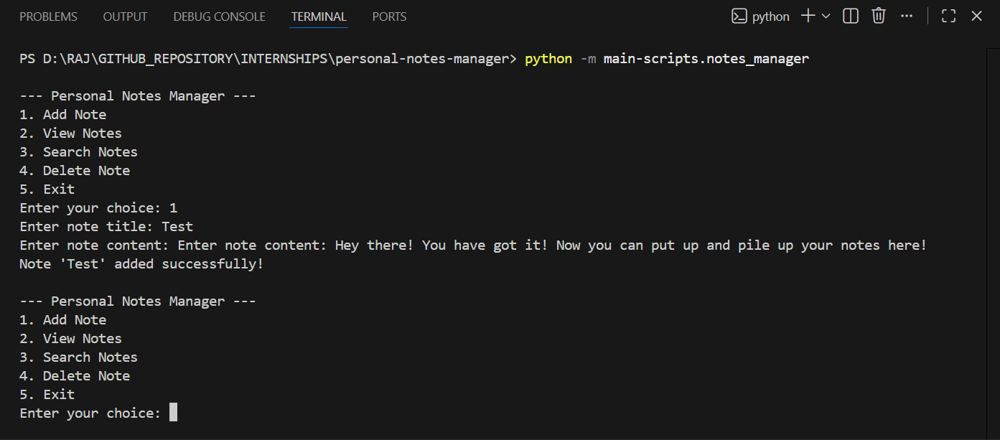
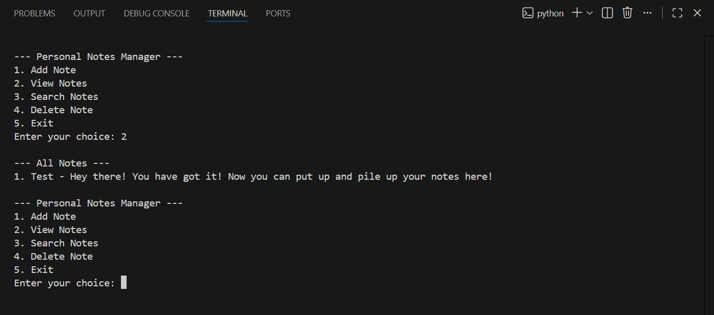
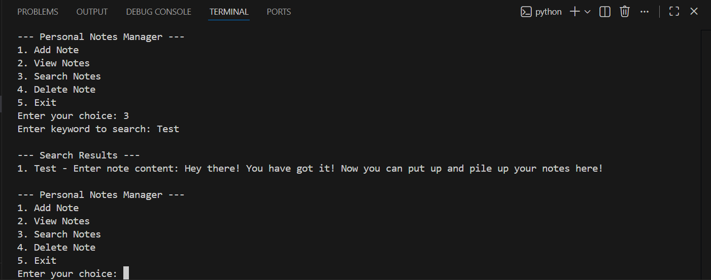
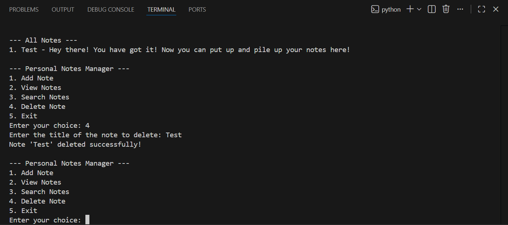
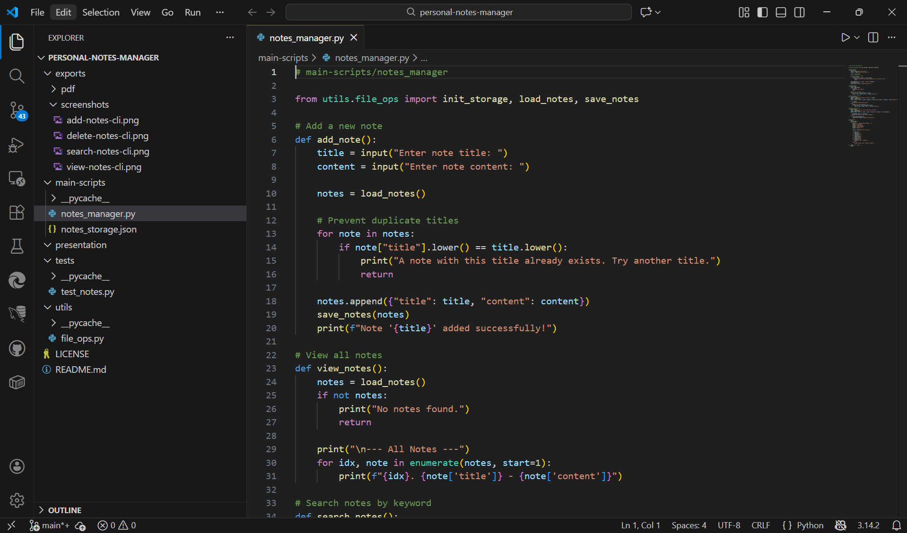
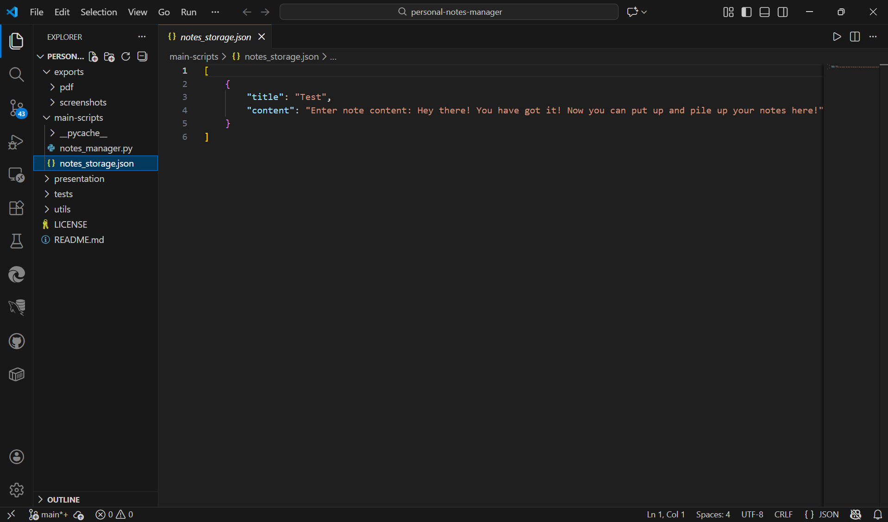

# Personal Notes Manager

## Overview
This project is part of the **Microsoft Elevate Internship (December 2025 Batch)**.  
It is a lightweight **CLI-based Notes Manager** built with Python.  
The goal is to provide a simple, reproducible workflow for managing notes — including **Add, View, Search, and Delete** — with persistent JSON storage and unit test validation.

---

## Features
- ➕ Add new notes (title + content)
- 📖 View all saved notes
- 🔍 Search notes by keyword/title
- 🗑️ Delete notes by title
- 💾 Lightweight JSON storage (`notes_storage.json`) [Click here to find all the Notes stored in as .json](main-scripts/notes_storage.json)
- 🧪 Unit tests with Python’s `unittest` framework
- Organized folder structure for reproducibility and clarity

---

## Tech Stack
- **Python** (**required**) → [Download](https://www.python.org/downloads/)  
  Libraries: `json`, `os`, `unittest` (built-in, no external dependencies)

### Future Extensions (Optional)
- Add **timestamps** to notes for better tracking
- Integrate with **Azure Functions** or **Copilot Studio** for cloud-based workflows

---

## Screenshots

### 🔹 Add Note [1st]


### 🔹 View Notes [2nd]


### 🔹 Search Notes [3rd]


### 🔹 Delete Note [4th]
 

### 🔹 Code-Editor [5th]



---

## Project Structure
```
personal-notes-manager/
├─ main-scripts/
│   ├─ notes_manager.py        # Main Python script (menu + logic)
│   └─ notes_storage.json      # File to store notes (JSON format)
├─ utils/
│   └─ file_ops.py             # Helper functions for file operations
├─ tests/
│   └─ test_notes.py           # Unit tests for storage functions
├─ docs/                       # Documentation and submission materials
│   └─ README.md
├─ exports/                    # Screenshots and PDF exports
│   ├─ screenshots/
│   └─ pdf/
├─ presentation/               # Demo presentation materials
├─ .gitignore
├─ LICENSE
└─ README.md  [You are here!]  # Project overview
```

---

## How to Run

### 1. Clone the Repository
First, clone the project locally from GitHub:
```bash
git clone https://github.com/rajghosh06-dev/personal-notes-manager.git
cd personal-notes-manager
```

### 2. Run the Notes Manager
From project root: (i.e., `/personal-notes-manager` )
```bash
python -m main-scripts.notes_manager
```

### 3. Run Unit Tests
```bash
python -m unittest tests.test_notes
```

---

## How It Works

This project automates note management using a modular Python workflow. Here’s the breakdown:

### 1. Storage Initialization
- Ensures `notes_storage.json` exists in `main-scripts/`.
- Initializes with an empty list if missing.

### 2. CRUD Operations
- **Add Note**: Prompts for title + content, prevents duplicates, saves to JSON.  
- **View Notes**: Lists all notes with index, title, and content.  
- **Search Notes**: Finds notes by keyword in title/content.  
- **Delete Note**: Removes notes by title.

### 3. Unit Testing
- Validates storage functions (`init_storage`, `load_notes`, `save_notes`).  
- Tests empty storage, single note, and multiple notes scenarios.  
- Ensures reproducibility with `setUp` and `tearDown`.

### 4. Storage
- The notes which are written by the user is stored in `main-scripts/notes_storage.json`.  
- Check out the sample, of how it looks below.  


---

## Notes
- No external dependencies — pure Python implementation.  
- Screenshots demonstrate CLI outputs for internship submission.  
- Project authored by **Rishit Ghosh** as part of the **Microsoft Elevate Internship**.

---

## Author
Developed by [**RISHIT GHOSH**](https://github.com/rajghosh06-dev)  
B. Tech CSE (AI & ML), Geethanjali College of Engineering and Technology  
**MS Elevate Internship | Capstone Project | December 2025 Batch | Microsoft Azure**  
Check out my Portfolio [here](https://rajghosh06-dev.github.io/portfolio/index.html).  

>To view the Project's Presentation, check out the directory `presentation/` OR [Click here](presentation/Personal_Notes_Manager_MS-ELEVATE_AZURE_PROJECT_PRESENTATION_RISHIT-GHOSH.pdf).  
>To checkout the Project Code, check out the directory `main-scripts/` OR [Click here](main-scripts/).

---

## License
This project is for academic and internship purposes.  
Feel free to reference or adapt with proper credit.

---

## 🔗 References
- Python Unittest Documentation [(docs.python.org in Bing)](https://www.bing.com/search?q="https%3A%2F%2Fdocs.python.org%2F3%2Flibrary%2Funittest.html")  
- [Microsoft Copilot Studio](https://learn.microsoft.com/en-us/microsoft-copilot-studio/fundamentals-what-is-copilot-studio)  
- JSON in Python [(docs.python.org in Bing)](https://www.bing.com/search?q="https%3A%2F%2Fdocs.python.org%2F3%2Flibrary%2Fjson.html")  

---

## Extras
### Notes on `notes_storage.json`

The file `notes_storage.json` is a **lightweight storage backend** for this project.  
It contains all notes in structured JSON format:

```json
[
    {
        "title": "Shopping List",
        "content": "Buy milk, eggs, bread"
    },
    {
        "title": "College Tasks",
        "content": "Submit assignment by Friday"
    }
]
```

- **How it’s created:** Automatically initialized by `init_storage()` if missing.  
- **How it’s used:** Read and written by `load_notes()` and `save_notes()`.  
- **Why JSON:** Human-readable, lightweight, and portable across systems.

---
